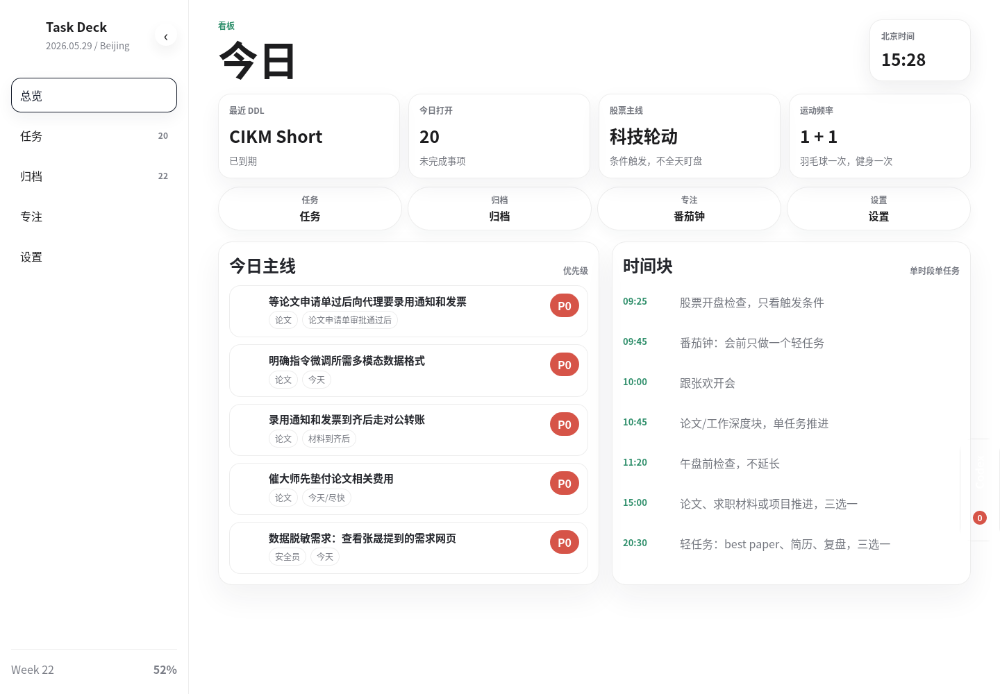
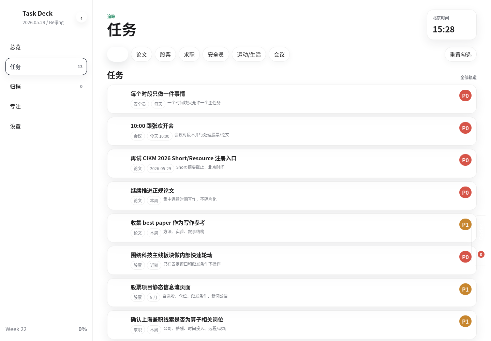
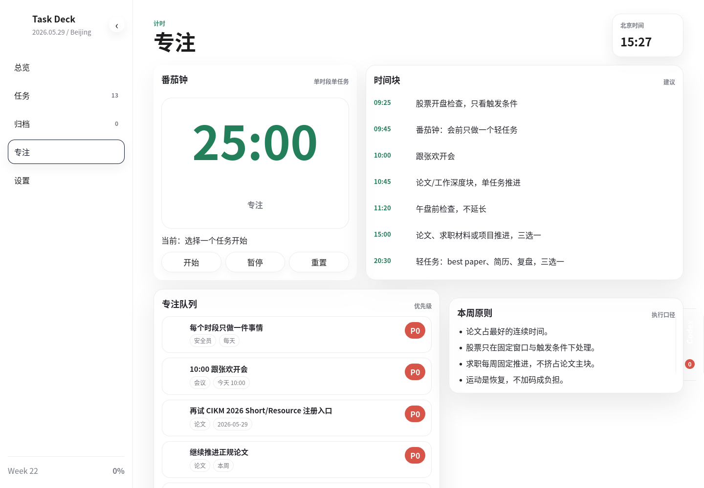
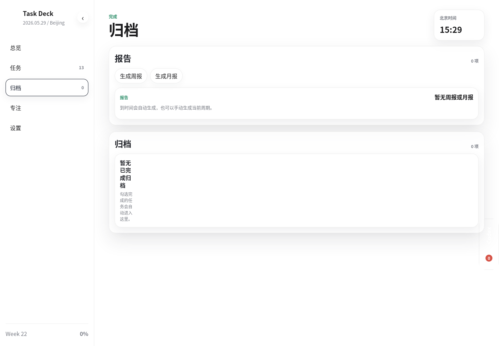

# 个人任务指挥台

中文 | [English](README.en.md)

一个给个人使用的任务看板、提醒系统和 Codex 操作桥。页面默认按北京时间展示任务、时间块、番茄钟、归档报告和浮动聊天窗；本地 SQLite 负责静态存储。

## 截图

| 总览 | 任务 |
| --- | --- |
|  |  |

| 专注 | 归档 |
| --- | --- |
|  |  |

## 功能

- 总览、任务、归档、专注、设置五个主页面。
- Codex 不再占用侧边栏页面，而是作为全局浮动聊天窗使用。
- SQLite 存储任务、提醒、网页留言、Codex 处理事件和周报/月报。
- 带具体时间的任务默认提前 10 分钟提醒。
- 企业微信机器人可同步提醒、Codex 关键结果和异常。
- 网页留言进入 `inbox` 后，服务端可自动调用本机 `codex exec --json`，并通过 SSE 把实时过程推送回页面。
- 自动桥会保存 Codex `thread_id`，后续网页留言使用 `codex exec resume` 续同一个网页专用会话。
- 外观保留三种主题：系统浅色、金融深海、冷灰。

## 启动

```bash
npm start
```

默认地址：

```text
http://127.0.0.1:8787/
```

语法检查：

```bash
npm run check
```

## 环境变量

- `WEWORK_WEBHOOK_URL`：企业微信机器人 webhook，用于提醒和结果同步。
- `CODEX_BIN`：Codex CLI 路径，默认 `codex`。
- `CODEX_AUTO_EXEC`：设为 `0` 可关闭网页留言自动执行。

`.env`、数据库、日志、pid 文件和 `node_modules/` 不提交到代码仓。
